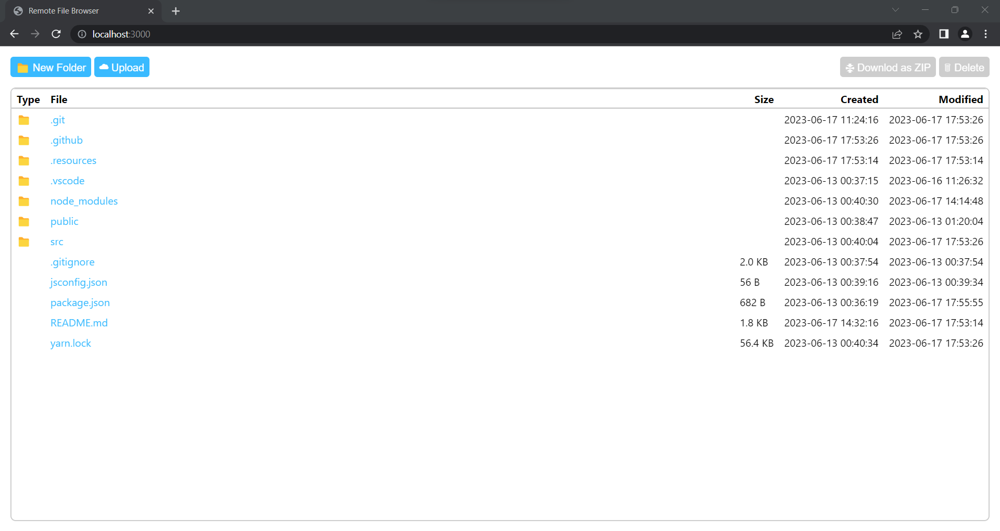
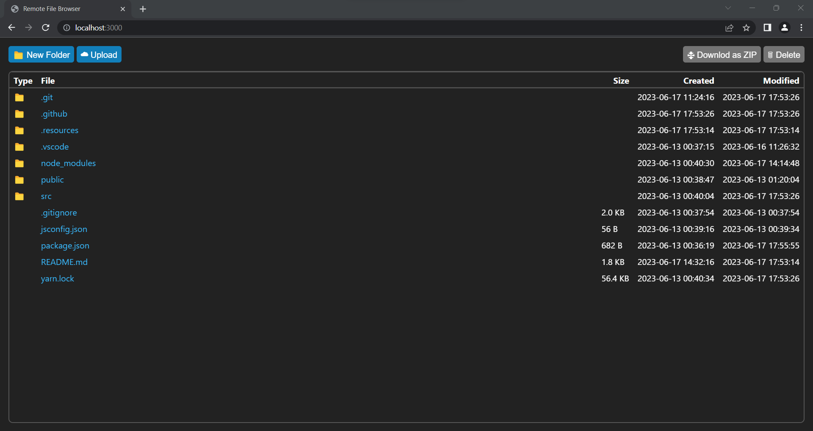

# file-browser-cli

[](https://badge.fury.io/js/file-browser-cli)

> Creates simple HTTP server to browse, download & upload files form your local system remotely.




The goal of this tool is to quickly create a remote server to browse and upload files. Most of the time I'll be simply using [http-server](https://www.npmjs.com/package/http-server) to quickly create a directory browser but it doesn't really have any option to upload files or to download bulk files. So I created this simple application - a lightweight http file browser with no bloat.

This is meant to be used as a quick and simple remote file browser. **THIS IS NOT DESIGNED TO BE A HIGHLY SECURE FILE SERVER. USE WITH CAUTION.**

## Features

- Optional HTTP basic auth support
- Download single files
- Download multiple files or folders as ZIP archive
- Upload single or multiple files
- Delete multiple files or folders
- Supports dark theme in modern browsers
- Works on IE 11 (If you are still using it for some reason ¯\\\_(ツ)\_/¯ )

## How to use

1. Install the package globally
   ```sh
   npm i -g file-browser-cli
   ```
2. Run the server,
   ```sh
   file-browser
   ```

## CLI

```sh
file-browser [options] [path]
```

> The `[path]` argument is optional. If not provided the current working directory will be served by default.

| Option     | Description                                                          | Default Value |
| ---------- | -------------------------------------------------------------------- | ------------- |
| -p, --port | Port to listen on                                                    | 3000          |
| --username | Username for HTTP basic auth. Should be used along with `--password` |               |
| --password | Password for HTTP basic auth. Should be used along with `--username` |               |
